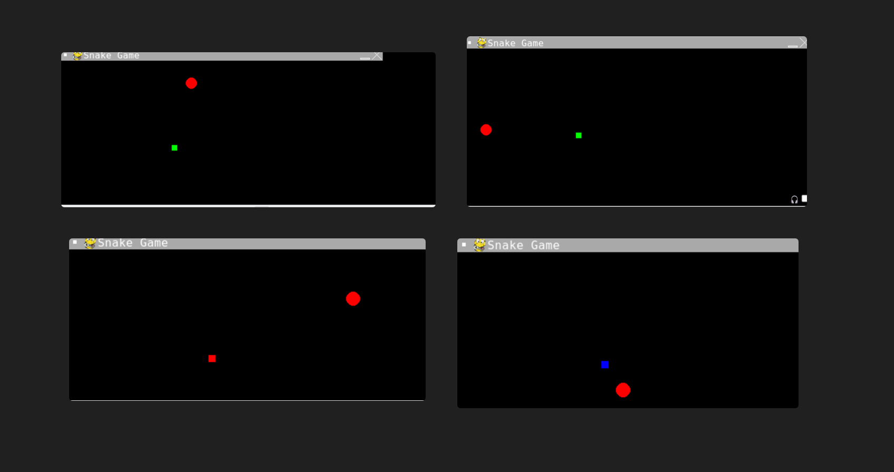
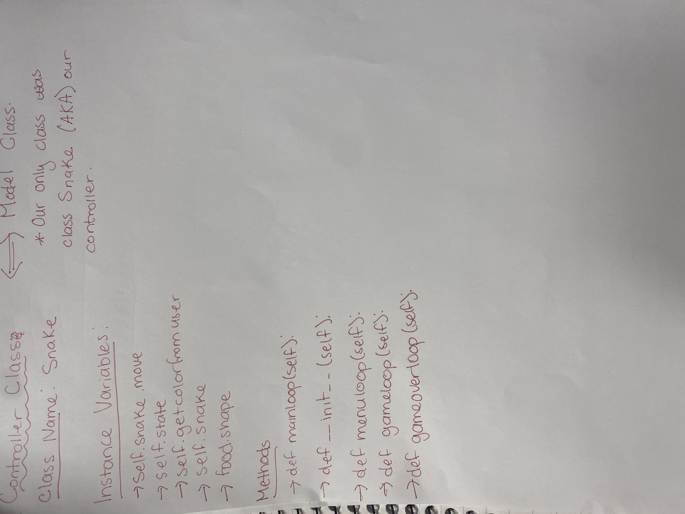

:warning: Everything between << >> needs to be replaced (remove << >> after replacing)
# CS110 Project Proposal
# Snake Game
## CS 110 Final Project
### Fall ,2022 
### [Assignment Description](https://docs.google.com/document/d/1H4R6yLL7som1lglyXWZ04RvTp_RvRFCCBn6sqv-82ps/edit?usp=sharing)

(https://replit.com/join/molgksuibk-mariaantonacci1)

(https://docs.google.com/presentation/d/1sfh-ZjcR-IjHj710h1KKkc-YtKiUlcEDcDzp0fWdBMw/edit?usp=sharing)

### Team: Snake
#### Maria Antonacci and Leena Ouafik

***

## Project Description

We modeled the snake game on google, we wanted the user to be able to choose the color of their snake and the shape of the fruit. We also wanted the user to use the arrow keys to move the snake around the screen to eat the fruit and gain points.

***    

## User Interface Design

- **Initial Concept**

The user types in the color they want their snake to be, the snake changes to the color of the users choice (if user chooses green, snake becomes green). The user types in the shape they want their fruit to be, the fruit changes to the shape of the users choice (if user chooses circle, food becomes circle).

    
- **Final GUI**

***        

## Program Design

* Non-Standard libraries
    * << You should have a list of any additional libraries or modules used (pygame, request) beyond non-standard python. 
         For each additional module you should include
         - url for the module documentation
         - a short description of the module >>
* Class Interface Design
    * 
        *  
* Classes
class Snake
Attributes:
  --> Surface
  --> Color
  --> Screen
  --> x, y
  --> font_style
  --> score_font 
Operations:
--> *- multiplicatipn
---> /- division
--> +=
--> ==
--> -=
--> + - addiiton
--> - (subtraction )
Responsibilities:
--> The Class Snake compiles all the code needed for the Snake Game 
  
## Project Structure and File List

The Project is broken down into the following file structure:

* main.py
* src
    * Snake.py 
* assets
    * N/A
* etc
    * N/A

***

## Tasks and Responsibilities 

* Maria→ created the screen, snake, food, and user input
Leena→ created scoreboard, keys for snake movement, game over, organized into classes

## Testing

* We verified that our code works by running the code in the shell and each time we added code, we checked if the code ran correctly.

## ATP

| Step                 |Procedure             |Expected Results                   |
|----------------------|:--------------------:|----------------------------------:|
|  1                   | Press UP Button      |Snake moves up on the screeen      |
|  2                     Press DOWN Button     Snake moves down on the screen 
|  3                      Press RIGHT Button    Snake moves right on the screen 
|  4                      Press LEFT Button     Snake moves left on the screen 
|  5                    Eating apple results in Player recieves 1 point for each apple eaten
                          a change of score   
|  6                Allow snake to collide with wall       "Gameover" displays on screen 
|  7                      User input            Snake changes color on the screen
| 8                       User input            Food changes shape on the screen
